# Dive into Kernel Launch Overhead and Host Synchronization Over head

我们知道 MegaKernel 的核心 motivation 之一是：**通过减少 Kernel 的数量减少 Kernel Launch 的开销以及和 host 侧的同步**。然而我们始终有下面几个疑问：
1. Kernel Launch 的开销，如何定义？
2. Kernel Launch 的开销、CPU-GPU 同步的开销，如何测算？
3. Kernel Launch 的开销，在不同的 **model** 上具体有多少？对 serving system 有着怎样的影响？

我们围绕上面几个问题，进行理论探究和实验分析。


## 定义 Kernel Launch 的开销

**Definition，E2E Kernel Latency ≈ CPU Launch Overhead + Other Overhead + GPU Execution Time (有效时间) + Synchronization Overhead，我们把 CPU Launch Overhead + Other Overhead 统称为 Kernel Launch Overhead，Synchronization Overhead 归类为 CPU-GPU 同步开销，做一个小小的区分。**

大体上，Kernel 从 `CPU 发射` 到 `GPU 实际执行` 这个过程中发生了什么，以及 Kernel Launch 的开销包含哪些组成部分，如下图所示：
1. Kernel Latency，内核总延迟。以 CPU 的视角观察，一次 e2e 的完整耗时。从 CPU 线程调用内核启动函数 `cuLaunchKernel` 或 `<<<...>>>` 等 CUDA API，一直到 CPU 线程通过 `cudaDeviceSynchronize()` 确认内核在 GPU 上执行完成经过的全部时间。
2. GPU Execution Time，GPU 执行开销。即有效工作部分，实实在在的 GPU 执行时间，完成 GEMM、Norm 等操作花费的时间 -> 通过优化 kernel 代码来降低这部分开销。
3. CPU Launch Overhead，CPU 启动开销。即 CPU 调用内核启动函数本身产生的延迟。CPU 执行 `<<<...>>>`，CUDA Driver 需要在 CPU 上完成一些准备工作，包括：检查和验证启动参数（Grid/Block维度、SMEM Size 等）、向 `Command Buffer`（CPU 侧 pinned buffer 上）中填充命令、准备要传输给GPU的参数等。这个过程完全在 CPU 上发生，GPU 甚至还未开始工作。
4. Other Overhead，其他开销，卡在 CPU Launch Overhead 和 GPU 执行时间之间的所有环节。包括：命令在 `Command Buffer` 中的等待时间、CPU->GPU 的通信延迟（即，GPU frontend 去 CPU pinned memory 的 `Command Buffer` 取指令的时间）、指令在 GPU 硬件队列中排队的时间，GPU 硬件调度器解析命令的时间、GPU 将计算任务分派到 SMs 上的时间等。大概就是这些部分。
5. Synchronization Overhead，同步开销/主机开销。主要是指 kernel 运行完之后需要和主机进行同步，特别是 Serving Framework 需要发起一些 CUDA API 操作比如 `cudaMemcpy` 之类的，并在 CPU Python Runtime 中更新一些 metadata、做一些决策。

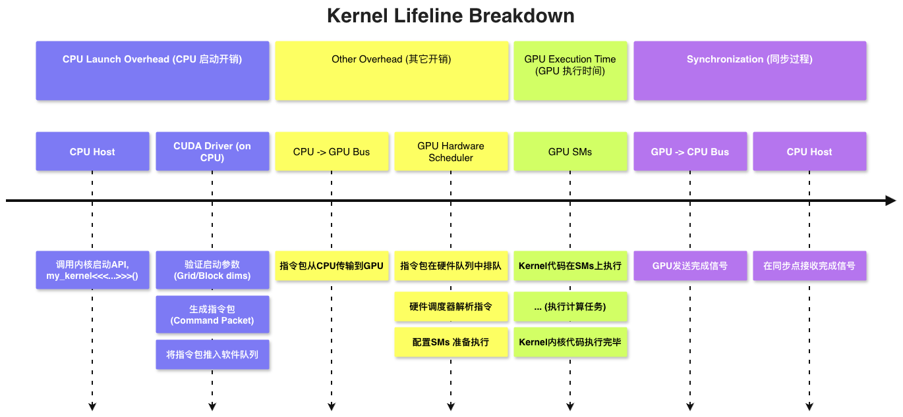


**Observation，Kernel Launch 和 GPU Execution 是异步的，形成异步的 producer/consumer 关系。**

CPU 把 kernel 解析成一系列命令写进 `Command Buffer`（位于 CPU 侧 pinned buffer）即返回，GPU 异步地去 `Command Buffer` 取单个 kernel 对应的所有命令在 GPU 侧执行。这样的性质形成经典的 producer/consumer 的关系，producer 即 CPU，consumer 即 GPU。Producer 生产的速率即 Kernel Launch Overhead + CPU-GPU synchronization Overhead；Consumer 消费的速率即 GPU Execution Time。

Producer/Consumer 关系：
1. Producer 生产速率 < Consumer 消费速率，`Command Buffer` 中 kernel 不足，使 GPU  utilization 不足，存在大量 bubble。此时，CPU Launch Overhead -> Other Overhead -> GPU Execution Time -> Synchronization Overhead，这四段是串行的。参考下图（qwen3.5-27B 在 eager mode 下 decode）中`nvjet_sm90_tst_64x8_64x16_4x1_v_bz_TNT`的 lifeline。
	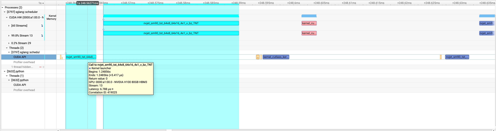

2. Producer 生产速率 > Consumer 消费速率，`Command Buffer` 充满 kernel，这带来 overlap 的机会，可以掩盖 Kernel Launch Overhead。参考下图（qwen3.5-27B 在 eager mode 下做 `prompt=8k`下的 prefill），做一些比较大的 GEMM 操作时，很容易将 GPU 计算资源吃满且运行时间较长，此时就会出现`Command Buffer Full` 的现象，Kernel A 在 launch 和 execute 之间甚至可能存在秒级的 latency。此时，大量的 kernel launch overhead 都被实际的 GPU execution 掩盖了。所以，所谓计算量更大的情况下 kernel launch overhead 不明显，本质上是因为 kernel launch 被 overlap 掩盖了，而不是单纯的 kernel launch 时间短。（当然不一定需要 `Command Buffer full`，只要 kernel 足够长就能带来 overlap 的机会）
	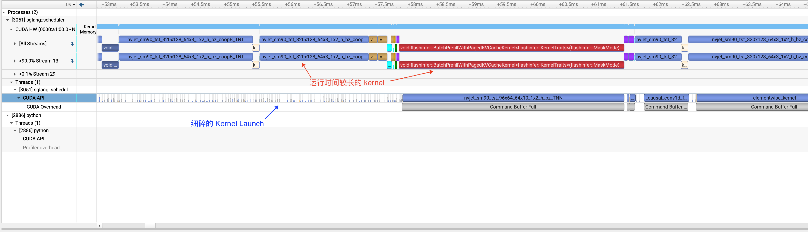


## 测算 Kernel Launch Overhead and Host Synchronization Overhead

上一章节的分析中，我们采用 eager mode，观察到明显的 bubble 情况（尤其是在 decode 中），本章节我们引入 cuda graph，观察 cuda graph 对 bubble 的消除能力，从而思考在有了 cuda graph 的情况，MegaKernel **通过减少 Kernel 的数量减少 Kernel Launch 的开销以及和 host 侧的同步** 的 motivation 是否站的住脚。

### 测算指标

首先，我们定义一些我们使用的指标：
- e2e_ms，端到端时间。表示一次 `generate()` 从 CPU 侧开始到结束的总耗时，包含 GPU 执行、CPU 调度、kernel launch、同步、sampling 等。
- total_kernel_gpu_ms，所有 kernel 执行时长的简单求和：`total_kernel_gpu_ms = sum(kernel.end - kernel.start)`，注意它不是 GPU 忙碌时间。如果多个 kernel 在不同 stream 上重叠执行，这个值会重复计入重叠部分，因此可能出现：`total_kernel_gpu_ms > e2e_ms`。
- launch_overhead_ms，CPU 侧 kernel launch API 调用耗时的累计和。统计的 API 包括：`cudaLaunchKernel*`、`cudaGraphLaunch*`、`cuLaunchKernel*`。测算方式：`launch_overhead_ms = sum(launch_api.end - launch_api.start)`，在 `command buffer` 空闲的情况下大致在 `2-10 us` 这个量级，但当 `command buffer full`，迅速膨胀到 ms 级、s 级。以及这个 overhead 只能反映 CPU Launch Overhead，无法反映 Other Overhead + CPU-GPU Synchronization Overhead，因此我们不推荐单纯观察这个指标。
- launch_overhead_pct，launch API 累计耗时占 e2e 的比例：`launch_overhead_pct = launch_overhead_ms / e2e_ms * 100%`，这个指标只适合粗略估算，不适合直接解释性能瓶颈。原因是：compute-bound 场景里 launch API 可能因为队列反压被撑大而高估影响；launch-bound 小模型/decode 场景里 API 本身很短，但 kernel 之间 GPU 空转很大，反而低估影响，因此我们不推荐单纯观察这个指标。

**下面一些指标对我们的 profiling 有更佳意义：**
- `gpu_busy_ms`，GPU 真正处于忙碌状态的时间。测算方式是收集所有 GPU activity 区间：kernel、memcpy、memset 等操作，然后对这些时间区间取并集，合并重叠部分，不会因为多 stream 并发而重复计时，一定满足 `gpu_busy_ms <= e2e_ms`。我们手动测算 GPU bubble ratio，一方面是因为 GPU utilization 对并发 operation 会重复计数，即 GPU utilization 可能超过 100%，而我们主要想看 GPU 因 kernel launch + host sync 导致的空闲情况，因此我们针对并发 operation 取并集计时，不过经过 check 我们的 `gpu_bubble_ratio` 和 `GPU Utilization` 的差别其实很小，不影响判断和结论；另一方面，没用 SM Utilization 是因为 vastai 不暴露 GPU 硬件计数器，导致无法进行 SM Utilization 的测试，而且我们主要探究 system-level GPU 的使用情况，而非 kernel 的性能。
- `gpu_bubble_ratio`，GPU 空闲比例。也就是 e2e 时间里 GPU 没有 activity 的部分，指示 GPU 有多少时间没有活干：`gpu_bubble_ratio = (e2e_ms - gpu_busy_ms) / e2e_ms`。反映 launch/host/scheduler/sync 导致的真实 GPU bubble。
- `unhidden_launch_api_ms`，即无法和实际运行的 GPU kernel overlap 的 CPU Launch Overhead，这完全被暴露出来，从意义上更接近实际的 CPU Launch Overhead，可以用来衡量潜在的可以被 CUDA Graph 或 MegaKernel 解决的 Kernel Launch Overhead。
- `other_host_idle_ms`：GPU 空转但 CPU 不在 launch API 中的时间，通常包括：cudaMemcpy D2H、sampling、scheduler、attention metadata planning、Python runtime 等，有 `other_host_idle_ms = gpu_bubble_ms - unhidden_launch_api_ms`。

关系说明：
```
gpu_bubble_ms
  = e2e_ms - gpu_busy_ms
  = GPU idle time
  = unhidden_launch_api_ms + other_host_idle_ms
```
### 实验设置

| 维度               | 取值                                                   |
| ---------------- | ---------------------------------------------------- |
| GPU              | 单卡 H100 80GB                                         |
| Framework        | SGLang + FlashInfer                                  |
| Models           | Qwen3-0.6B / 1.7B / 8B / 14B / 30B-A3B + Qwen3.5-27B |
| Modes            | eager, cudagraph                                     |
| Prefill-dominant | BS=1, prompt={16,256,1k,4k,8k}                       |
| Decode           | BS=1, prompt16, decode={128,512}                     |
| Batch Decode     | BS={1,4,8,16}, prompt16, decode={128,512}            |

### Kernel Launch Overhead and Host Synchronization Overhead for Decode

我们知道 CUDA Graph 能够降低 Kernel Launch Overhead 和 Host Synchronization Overhead，下面我们通过观察在有了 cuda graph 的情况下，MegaKernel **通过减少 Kernel 的数量减少 Kernel Launch 的开销以及和 host 侧的同步** 的 motivation 是否站的住脚。


我们在 BS=1、prompt=16 下，在 decode=512 的 eager 和 cudagraph 模式下，测算 GPU bubble ratio 如下图所示：

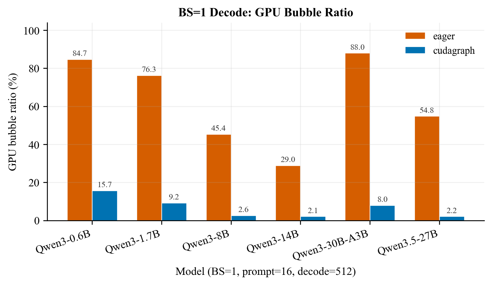
<center> BS=1、prompt=16、decode=512 的 GPU Bubble Ratio</center>

我们在 BS=1、prompt=16 下，做 decode=128 / decode=512 的测试，测算 eager -> cudagraph e2e speedup，结果如下图：

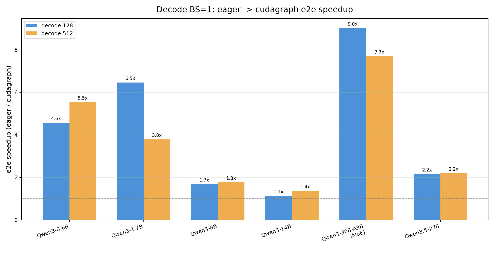
<center> BS=1、prompt=16 下 Decode 的 Eager 到 Cudagraph E2E Speedup</center>

我们对 BS = 1、decode = 512 的测试，进行详细数据的展开如下：

| Model         | bubble eager -> cg | e2e speedup | TPOT eager -> cg | launch count eager -> cg | bubble ms eager -> cg | unhidden launch ms eager -> cg | other host idle ms eager -> cg |
| ------------- | -----------------: | ----------: | ---------------: | -----------------------: | --------------------: | -----------------------------: | -----------------------------: |
| Qwen3-0.6B    |     84.7% -> 14.0% |       5.64x |     8.69 -> 1.54 |            374.9 -> 17.0 |          7.36 -> 0.22 |                 1.164 -> 0.077 |                   6.20 -> 0.14 |
| Qwen3-1.7B    |      76.3% -> 8.6% |       3.81x |     8.73 -> 2.29 |            374.9 -> 17.0 |          6.66 -> 0.20 |                 1.132 -> 0.036 |                   5.53 -> 0.16 |
| Qwen3-8B      |      45.3% -> 2.4% |       1.77x |    11.40 -> 6.45 |            513.1 -> 17.0 |          5.17 -> 0.16 |                 0.929 -> 0.014 |                   4.24 -> 0.14 |
| Qwen3-14B     |      28.9% -> 2.0% |       1.37x |   15.03 -> 10.99 |            568.2 -> 17.0 |          4.34 -> 0.22 |                 0.677 -> 0.014 |                   3.66 -> 0.21 |
| Qwen3-30B-A3B |      88.1% -> 7.8% |       7.73x |    35.62 -> 4.61 |            822.5 -> 17.0 |         31.37 -> 0.36 |                 3.050 -> 0.066 |                  28.32 -> 0.29 |
| Qwen3.5-27B   |      54.8% -> 1.6% |       2.21x |   43.33 -> 19.63 |            975.5 -> 18.0 |         23.73 -> 0.32 |                 2.244 -> 0.014 |                  21.49 -> 0.31 |

从上面两幅图，以及详细数据的表格可以看出，我们进行分析：

1. 在 eager decode 中，`other_host_idle_ms` 通常远大于 `unhidden_launch_api_ms`。这说明系统瓶颈不是裸 kernel launch API 时间本身，而是 launch API 之间的 scheduler / sampling / sync / framework 逻辑让 GPU 等待。
2. 观察 `eager -> cudagraph e2e speedup`，普遍是非常显著的，小模型和 MoE decode 最 launch/host-bound，因此 speedup 最大；更大的 dense model 下使用 CUDA Graph 的收益会降低，但依然足够显著。
3. 观察 `launch count eager -> cg` 列，在 decode 中，CUDA Graph 已经能够显著压缩 kernel launch 的次数；随着 kernel launch 次数的大幅降低，`unhidden launch ms eager -> cg` 降低到 0.0x ms 的量级，以 qwen3-8B 为例，这部分 `Kernel Launch Overhead` 仅占 TPOT 的 0.2%；类似地，`other host idle ms eager -> cg` 也大幅降低，以 qwen3-8B 为例，这部分 `Host Synchronziation Overhead` 占 TPOT 的 2%。
4. 观察 `bubble eager -> cg`，CUDA Graph 已经可以将中等模型及大模型的 GPU bubble 压低至 2% 的级别（几乎完全来自于 Host Synchronization Overhead）。

结合 MegaKernel 进行思考：
- MegaKernel 当然可以节省 Kernel Launch Overhead / CPU Launch Overhead，但是 CUDA Graph 已经做的足够好。一方面，SGLang 本身就让 Kernel Launch 很好地被 kernel 的执行所掩盖；另一方面，使用 CUDA Graph 之后，单次 decode 所启动的 kernel 数量已经足够少了，未能掩盖的 Kernel Launch 以及 host 同步开销也已经足够小了。此时，为了 2% 级别的 host 同步开销，进而将 CPU 侧控制逻辑放弃，完全进入 GPU Runtime 调度，反而可能因为引入更复杂的 GPU 调度/同步逻辑，导致 Serving System 的性能下降。得不偿失。

**Claim，在 CUDA Graph 适用的 workload（如 decode） 上，CUDA Graph 已经可以极大降低 Kernel Launch Overhead 和 Host Overhead，MegaKernel 通过减少 Kernel 的数量来减少 Kernel Launch Overhead + Host Overhead 的收益上限不高。**


然后，我们在长上下文下进行 decode：

下面的统计使用 `bs1_p8k_d512`，即 BS=1、prompt=8k 后继续 decode512，我们统计 decode 段数据。
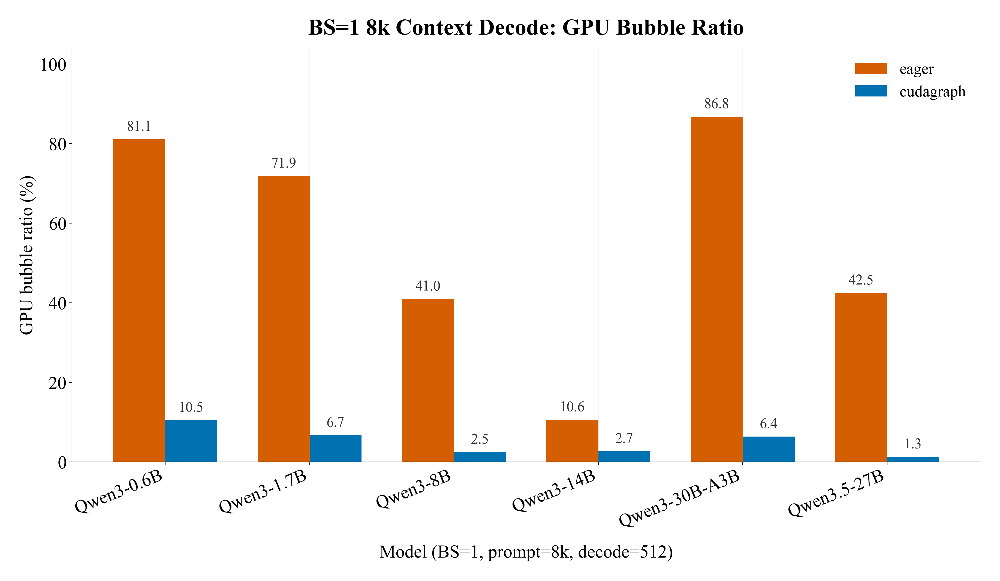
<center> 8k 长上下文 Decode512 的 GPU Bubble Ratio</center>

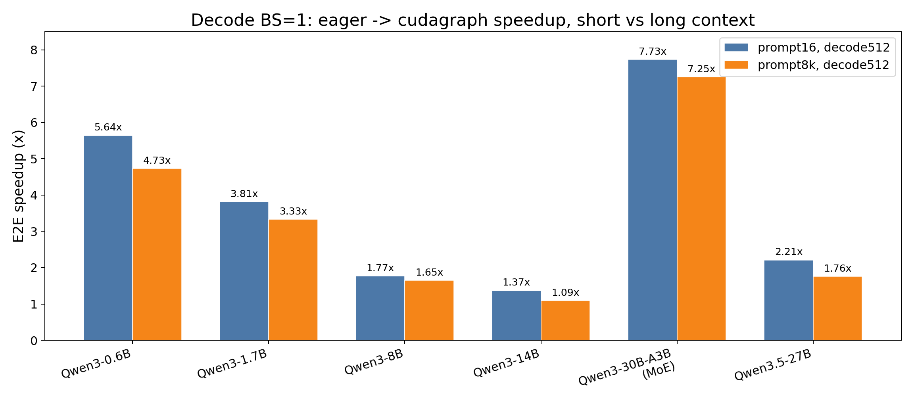
<center> 短上下文与长上下文 Decode512 的 Eager 到 Cudagraph Speedup</center>

| Model         | bubble eager -> cg | e2e speedup | TPOT eager -> cg | launch count/step eager -> cg | bubble ms/step eager -> cg | unhidden launch ms/step eager -> cg | other host idle ms/step eager -> cg |
| ------------- | -----------------: | ----------: | ---------------: | ----------------------------: | -------------------------: | ----------------------------------: | ----------------------------------: |
| Qwen3-0.6B    |     81.1% -> 10.5% |       4.73x |     9.08 -> 1.92 |                 381.0 -> 17.0 |              7.37 -> 0.20 |                       1.132 -> 0.048 |                        6.24 -> 0.15 |
| Qwen3-1.7B    |      71.9% -> 6.7% |       3.33x |     8.93 -> 2.68 |                 381.0 -> 17.0 |              6.42 -> 0.18 |                       1.062 -> 0.027 |                        5.36 -> 0.15 |
| Qwen3-8B      |      41.0% -> 2.5% |       1.65x |    12.38 -> 7.49 |                 521.0 -> 17.0 |              5.07 -> 0.19 |                       0.927 -> 0.021 |                        4.14 -> 0.17 |
| Qwen3-14B     |      10.6% -> 2.7% |       1.09x |   13.63 -> 12.48 |                 577.0 -> 17.0 |              1.45 -> 0.34 |                       0.242 -> 0.125 |                        1.21 -> 0.21 |
| Qwen3-30B-A3B |      86.8% -> 6.4% |       7.25x |    39.00 -> 5.38 |                 833.0 -> 17.0 |             33.86 -> 0.35 |                       3.269 -> 0.064 |                       30.60 -> 0.28 |
| Qwen3.5-27B   |      42.5% -> 1.3% |       1.76x |   36.08 -> 20.55 |                 979.0 -> 18.0 |             15.34 -> 0.27 |                       1.541 -> 0.013 |                       13.80 -> 0.26 |

结果显示，长上下文 KV read 会摊薄一部分 launch/host bubble，但不会消除 decode 中的 host overhead。对较大的 dense model，prompt 从 16 增加到 8k 后，decode 更接近 GPU/KV-read-bound：例如 Qwen3-14B 的 speedup 从 1.37x 降到 1.09x，说明 CUDA Graph 的增量空间已经降低了不少。但小模型和 MoE 仍然明显 launch/host-bound：Qwen3-0.6B 仍有 4.73x speedup，Qwen3-30B-A3B 仍有 7.25x speedup。

大致的 claim 依旧是：在 CUDA Graph 适用的 workload（如 decode） 上，即使 decode 的上下文较长，CUDA Graph 依然可以极大降低 Kernel Launch Overhead 和 Host Overhead，MegaKernel 通过减少 Kernel 的数量来减少 Kernel Launch Overhead + Host Overhead 的收益上限不高。

### Kernel Launch Overhead and Host Synchronization Overhead for Prefill

对 Qwen3 系列来说，SGLang 的 prefill 默认走 piecewise CUDA Graph，而 Qwen3.5-27B fall back 没有做 piecewise CUDA Graph。
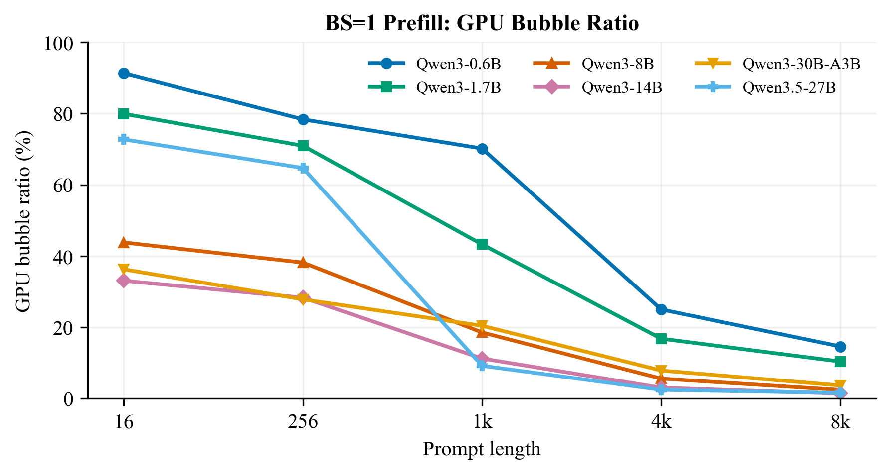
<center> BS=1 Prefill 的 GPU Bubble Ratio</center>

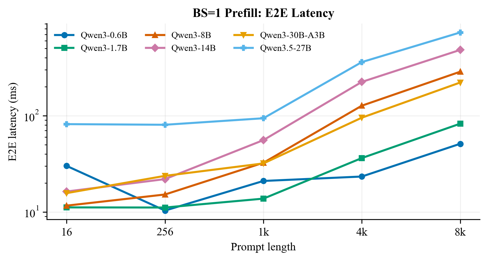
<center> BS=1 Prefill 的 E2E Latency</center>

以 BS=1，prompt=8k，piecewise CUDA Graph Prefill 为例：

| Model         | e2e ms | launch count | cudaGraphLaunch | bubble ms | bubble% | unhidden launch ms | other host idle ms |
| ------------- | -----: | -----------: | --------------: | --------: | ------: | -----------------: | -----------------: |
| Qwen3-0.6B    |  51.11 |          168 |              29 |      7.47 |   14.6% |               0.21 |               7.26 |
| Qwen3-1.7B    |  82.69 |          168 |              29 |      8.58 |   10.4% |               0.21 |               8.36 |
| Qwen3-8B      | 286.74 |          208 |              37 |      6.89 |    2.4% |               0.14 |               6.75 |
| Qwen3-14B     | 483.14 |          228 |              41 |      6.69 |    1.4% |               0.15 |               6.54 |
| Qwen3-30B-A3B | 221.47 |          220 |              49 |      8.09 |    3.7% |               0.18 |               7.92 |
| Qwen3.5-27B   | 733.65 |        1,683 |               0 |     11.48 |    1.6% |               0.98 |              10.49 |


**Claim，decode 中 CUDA Graph 已经把 kernel launch 和 host overhead 压到很低，因此 MegaKernel 继续减少 kernel 数量的收益上限有限；prefill 则呈现明显的 prompt-dependent 行为。短 prompt 下，实际 GPU work 太少，prefill 中会形成很高的 GPU bubble；但随着 prompt 增长，GEMM/attention 计算变长，这部分固定开销被明显摊薄：Qwen3-8B/14B/Qwen3.5-27B 的 bubble ratio 已经降到 1%-3% 量级。因此 MegaKernel 的这一 motivation 对 prefill 主要在中小 prompt 下成立。**

### BS=1  summary

**Claim1，在 CUDA Graph 适用的 workload（如 decode） 上，CUDA Graph 已经可以极大降低 Kernel Launch Overhead 和 Host Overhead，MegaKernel 通过减少 Kernel 的数量来减少 Kernel Launch Overhead + Host Overhead 的收益上限不高。为了 2% 级别的 host 同步开销，进而将 CPU 侧控制逻辑放弃，完全进入 GPU Runtime 调度，反而可能因为引入更复杂的 GPU 调度/同步逻辑，导致 Serving System 的性能下降。得不偿失。**

**Claim2，prefill 则呈现明显的 prompt-dependent 行为。短 prompt 下，实际 GPU work 太少，prefill 中会形成很高的 GPU bubble；但随着 prompt 增长，GEMM/attention 计算变长，这部分固定开销被明显摊薄：Qwen3-8B/14B/Qwen3.5-27B 的 bubble ratio 已经降到 1%-3% 量级。因此 MegaKernel 通过减少 Kernel 的数量来减少 Kernel Launch Overhead + Host Overhead 的 motivation 主要在中小 prompt 下成立。**

联想到之前做的 MPK/vLLM/SGLang 的 TTFT 和 TPOT 性能试验，当时没能解释的 2 点，和我们今天观察到的其实是相符的：
- 针对 prefill，`prompt_len=16` 的时候，MPK 确实小有优势，这部分优势很可能就来自于 MegaKernel 对 GPU Bubble 的消解；但可惜 MegaKernel 的 `mbt=16` 设计使得架构优势在 prefill 上迅速衰减，甚至在 `prompt_len=32` 的时候就开始比不过 vLLM/SGLang了。
- 针对 decode，在我们的实测中，MPK 干不过 vLLM/SGLang CUDA Graph，这同样和我们观察到的 "`CUDA Graph` 已经能有效地降低 Kernel Launch 和 Host Overhead" 这一现象是相符的，
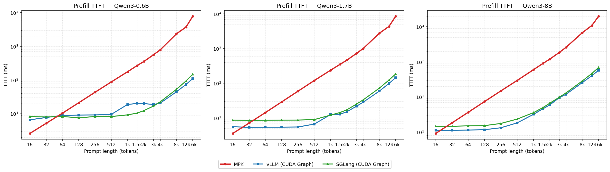
<center> MPK/vLLM/SGLang 的 TTFT 性能</center>


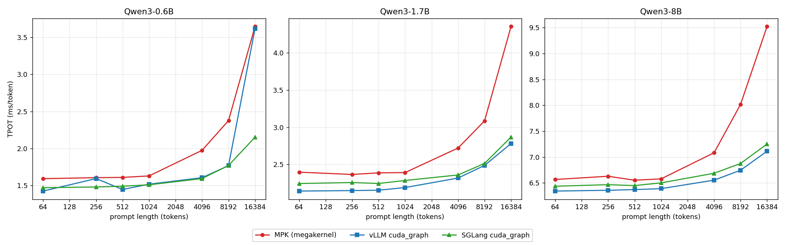
<center> MPK/vLLM/SGLang 的 TPOT 性能</center>

**Claim3，按照上面对 GPU bubble 的观察，单卡 H100 serve 实验模型在 `prompt=1k` 下依然保持 10% 的 bubble，在 `prompt=256` 下更是普遍有 25% 以上的 bubble。如果能利用 MegaKernel 架构消除这部分 bubble，同时将 MPK 对 prefill 的支持做好，同时像 ETC那样支持动态的 `input_shape`，看起来 MegaKernel 是可以做好的 prefill 的。**


## Batch sweep test

下图 给出 decode128 / decode512 的 batch sweep speedup。

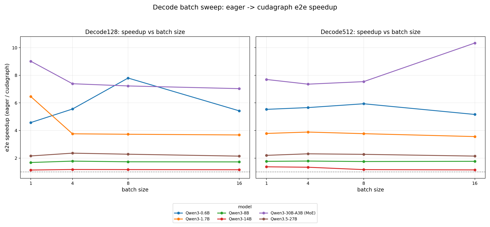
<center> Decode Batch Sweep 的 Eager 到 Cudagraph Speedup</center>

选取 BS=8、prompt=16, decode=512，每次decode 的详细指标表格如下：

| Model         | bubble eager -> cg | e2e speedup | TPOT eager -> cg | launch count/step eager -> cg | bubble ms/step eager -> cg | unhidden launch ms/step eager -> cg | other host idle ms/step eager -> cg |
| ------------- | -----------------: | ----------: | ---------------: | ----------------------------: | -------------------------: | ----------------------------------: | ----------------------------------: |
| Qwen3-0.6B    |     85.4% -> 12.9% |       6.00x |    10.15 -> 1.69 |                 402.9 -> 17.0 |              8.67 -> 0.22 |                       1.404 -> 0.060 |                        7.27 -> 0.16 |
| Qwen3-1.7B    |      76.0% -> 8.8% |       3.79x |     9.39 -> 2.48 |                 402.9 -> 17.0 |              7.13 -> 0.22 |                       1.245 -> 0.040 |                        5.88 -> 0.18 |
| Qwen3-8B      |      44.8% -> 3.4% |       1.75x |    11.98 -> 6.84 |                 549.1 -> 17.0 |              5.37 -> 0.23 |                       1.003 -> 0.020 |                        4.37 -> 0.21 |
| Qwen3-14B     |      15.8% -> 2.4% |       1.16x |   13.30 -> 11.42 |                 608.3 -> 17.0 |              2.10 -> 0.27 |                       0.354 -> 0.016 |                        1.75 -> 0.25 |
| Qwen3-30B-A3B |      87.9% -> 8.5% |       7.57x |    39.06 -> 5.16 |                 870.5 -> 17.0 |             34.32 -> 0.44 |                       3.366 -> 0.080 |                       30.95 -> 0.36 |
| Qwen3.5-27B   |      55.5% -> 0.5% |       2.28x |   47.79 -> 20.95 |                1135.5 -> 18.0 |             26.53 -> 0.10 |                       2.779 -> 0.004 |                       23.75 -> 0.09 |

BS=8 的观察和 BS=1 decode=512 基本一致，对于 decode 而言，batch 变大不会消除 cudagraph 的价值，decode 终究是 memory-bound/launch bound 的过程。


## Conclusion

在考虑和 CUDA Graph 对比的情况下，MegaKernel “通过减少 kernel 数量降低 launch/host overhead” 这个 motivation 较弱。特别是在较大的 dense model 上，通过 cuda graph 优化后暴露的 GPU bubble 已经很少了，此时为了 2% 级别的 host 同步开销，进而将 CPU 侧控制逻辑放弃，完全进入 GPU Runtime 调度，反而可能因为引入更复杂的 GPU 调度/同步逻辑，导致 Serving System 的性能下降，得不偿失。

不过，在小模型（实际应用价值有限）、大模型短 prompt（稍微真实一些的场景）、MOE（真实）下，即使使用 CUDA Graph，我们往往依然观察到 10% 级别的 GPU bubble，如果通过 MegaKernel 架构能充分利用这部分 bubble，同时保证 GPU 调度/同步逻辑不反过来拖累 GPU kernel 的运行，MegaKernel 的这个 `通过减少 kernel 数量降低 launch/host overhead` 就依然是有意义的。
